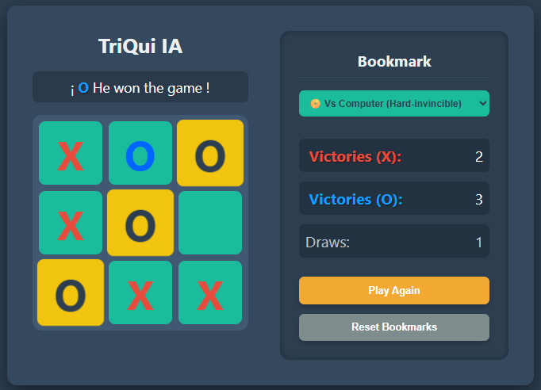

# ♨️ Triqui con IA Invencible (Minimax)

Juego de Triqui (Tic-Tac-Toe) construido en HTML, CSS y JavaScript puro sin frameworks ni dependencias, con un oponente de inteligencia artificial que implementa el algoritmo **Minimax con poda alfa-beta**, matemáticamente invencible.



## Por qué este proyecto

Cualquiera puede construir un Triqui que dibuje X y O en una cuadrícula. La parte interesante y la que demuestra pensamiento algorítmico real es la IA: en lugar de jugadas aleatorias o reglas básicas tipo "si puedo ganar, gano", este proyecto implementa el mismo algoritmo de teoría de juegos usado en motores de ajedrez y damas para explorar el árbol completo de posibilidades y elegir siempre la jugada óptima.

## Características

- **3 modos de juego**: Jugador vs Jugador, vs Computadora (Fácil — aleatoria) y vs Computadora (Difícil — invencible).
- **IA con Minimax + poda alfa-beta**, implementada desde cero, sin librerías externas.
- **Línea ganadora resaltada** con animación, en vez de solo anunciar el resultado por texto.
- **Marcador persistente** durante la sesión (victorias de X, O y empates).
- **Código modular**: lógica de la IA (`ai.js`) completamente separada de la lógica del juego y el DOM (`game.js`), siguiendo el principio de responsabilidad única.
- **Pruebas automatizadas** que verifican no solo que la IA "funciona", sino que es realmente invencible — incluyendo una simulación de 200 partidas contra jugadas aleatorias.

## Cómo funciona la IA

Minimax simula recursivamente cada jugada posible hasta el final de la partida, asumiendo que ambos jugadores juegan de forma óptima:
- Si es el turno de la computadora, elige la jugada que **maximiza** su resultado.
- Si es el turno del humano, Minimax asume que elegirá la jugada que **minimiza** el resultado de la computadora (el peor caso posible).

Esto garantiza que la IA nunca pierda: en el peor de los casos, empata.

La **poda alfa-beta** es una optimización que descarta ramas del árbol de búsqueda que ya no pueden cambiar la decisión final, evitando exploración innecesaria. Para Triqui no es estrictamente necesaria (el árbol de posibilidades es pequeño), pero se incluyó a propósito para demostrar el concepto — es la misma técnica que usan motores de ajedrez reales para explorar árboles mucho más grandes de forma eficiente.

## Prueba real de que la IA es invencible

El archivo `tests/test_ai.js` no solo prueba casos puntuales — también simula **200 partidas completas** de la IA contra un oponente que juega al azar, y verifica que la IA nunca pierda ninguna:

```
OK: la IA toma la jugada ganadora inmediata cuando existe.
OK: la IA bloquea la jugada ganadora del oponente.
OK: la IA (dificil) no perdio ninguna de 200 partidas contra un oponente aleatorio.
```

Esta es la salida real de correr las pruebas en este repositorio, no una afirmación sin respaldo.

## Tecnologías

- **HTML5** — estructura semántica
- **CSS3** — Flexbox para el layout, animaciones con `@keyframes`
- **JavaScript (ES6+)** — sin frameworks ni librerías
- **Node.js** — usado únicamente para correr las pruebas automatizadas de la IA (el juego en sí no lo necesita)

## Estructura del proyecto

```
triqui-tres-en-raya/
├── README.md
├── LICENSE
├── .gitignore
├── index.html
├── css/
│   └── styles.css
├── js/
│   ├── ai.js          # Minimax + poda alfa-beta (lógica pura, sin DOM)
│   └── game.js         # Estado del juego, eventos, DOM
├── tests/
│   └── test_ai.js       # Pruebas de la IA, corren con Node.js
└── assets/
    └── preview.png
```

## Cómo ejecutarlo

No necesita servidor, build ni instalación de dependencias.

```bash
git clone https://github.com/tu-usuario/triqui-tres-en-raya.git
cd triqui-tres-en-raya
```

Luego simplemente abre `index.html` con doble clic, o desde VS Code con la extensión "Live Server".

## Cómo correr las pruebas

Requiere tener [Node.js](https://nodejs.org) instalado.

```bash
node tests/test_ai.js
```

## Qué demuestra este proyecto

- Implementación de un algoritmo clásico de inteligencia artificial (búsqueda adversarial) desde cero, no copiado de una librería.
- Separación de responsabilidades: lógica pura vs. manipulación del DOM.
- Pruebas automatizadas orientadas a comportamiento, no solo a "que no truene".
- Manejo de estado de UI (turnos, modos de juego, marcador) de forma ordenada, sin frameworks.

## Licencia

MIT — ver [LICENSE](LICENSE).

## Autor

Cristian Camilo Duque Franco — Estudiante de Análisis y Desarrollo de Software (SENA)
